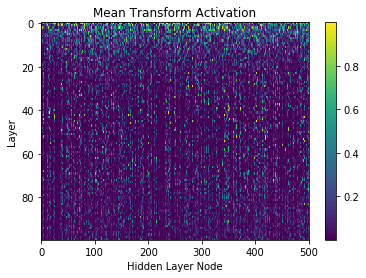

# Highway Networks

TensorFlow implementation of [Highway Networks](https://arxiv.org/abs/1505.00387). These networks shown to allow training with deeper architectures than traditional networks. 



## Data
All evaluations were done using MNIST which can be downloaded from [here](https://pjreddie.com/projects/mnist-in-csv/)

The data should be structured like

```
--HighwayNetworks
    --Data
        --MNIST
            --train.csv
            --test.csv
```

## Repository Information
*  `Highway Networks Demo.ipynb` notebook that shows how the networks is constructed.
*  `Plain vs Highway.ipynb` flexible notebook that compares plain networks with highway networks
*  `utils.py` data processing functions
*  `modules.py` helper functions for building networks
*  `models.py` builds networks
